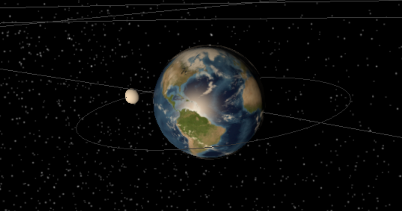
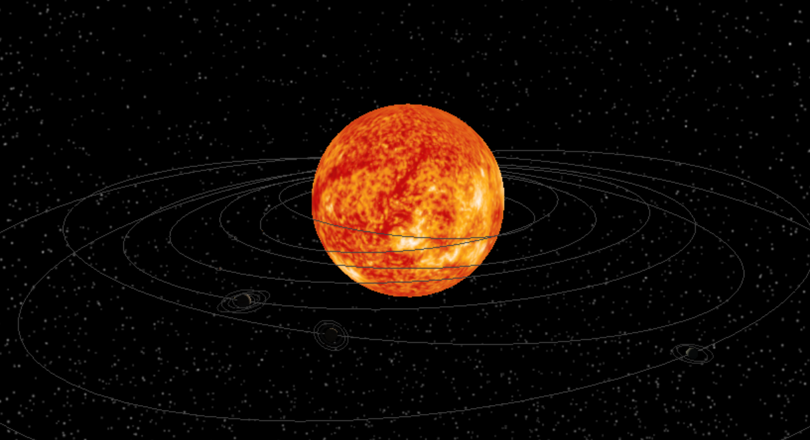
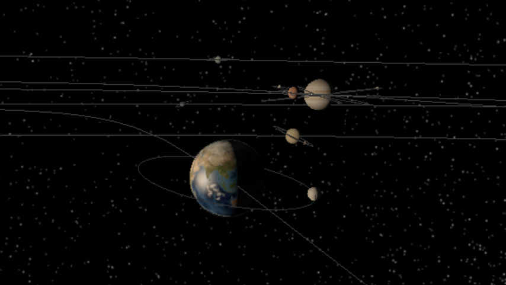
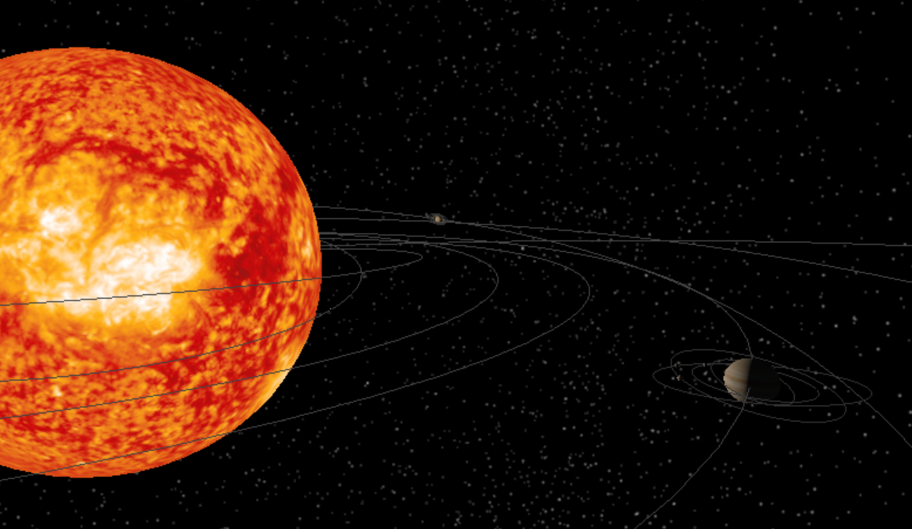
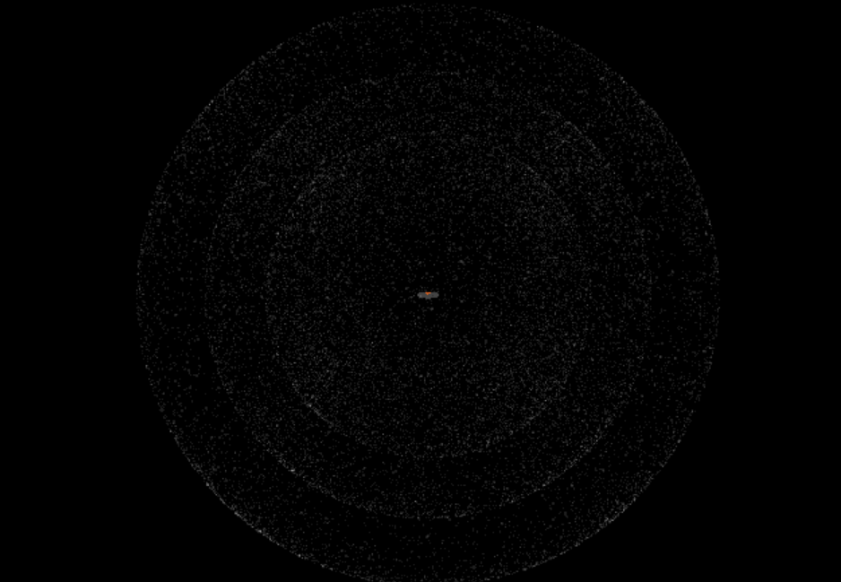

<h1 style="text-weight: bold;">SOLAR SYSTEM</h1>

Enlace a la demo (CodeSandbox): https://m273p6.csb.app/



## Índice

- [Introducción](#introducción)
- [Tecnologías utilizadas](#tecnologías-utilizadas)
- [Dependencias](#dependencias)
- [Modos de vista](#modos-de-vista)
- [Texturas](#texturas)
- [Fondo y Estrellas](#fondo-y-estrellas)
- [Iluminación y Órbitas](#iluminación-y-órbitas)
- [Fuentes y Documentación](#fuentes-y-documentación)
- [Vídeo de uso](#vídeo-de-uso)

## Introducción

El proyecto consiste en la creación de un sistema solar en 3 dimensiones en el cuál se reprensentan los objetos (planetas, satélites y estrellas) que componen al mismo además de diferentes controles para manejar el modelo a gusto del usuario.

En el modelo se han incluido los siguientes cuerpos pertenecientes al sistema solar:

- **Sol:** El sol es la estrella central, responsable de la mayor parte de la masa del sistema solar así como la fuente de luz y calor que mantiene a todos los demás cuerpos en órbita.

- **Planetas (Se dividen en dos grupos)**
    - **Planetas interiores (rocosos):** Mercurio, Venus, la Tierra y Marte. Tienen una superficie sólida.
    - **Planetas exteriores (gaseosos):** Júpiter, Saturno, Urano y Neptuno. Son significativamente más grandes que los interiores y están compuestos principalmente de gases como hidrógeno y metano.

- **Satélites:** Son los cuerpos que orbitan alrededor de los planetas, comúnmente se llaman lunas.

## Tecnologías Utilizadas

Para realizar el modelo se ha hecho uso de JavaScript utilizando la librería three.js. 

El proyecto se ha realizado en CodeSandbox y se ha exportado posteriormente a VSCode (para ejecutar el HTML en VSCode se ha hecho uso de la extensión *Live Server*).

## Dependencias

En cuanto al código, lo primero que se ha realizado son las importaciones necesarias para el proyecto, como se ha mencionado antes, se ha utilizado **three.js**. Comentar que todo el código tiene cada una de sus partes principales con un comentario que define la funcionalidad de dicha parte.

```js
import * as THREE from "three";
import { OrbitControls } from "three/examples/jsm/controls/OrbitControls";
```

## Modos de vista

Una vez con las dependencias importadas, se crean variables globales necesarias para su posterior uso dentro del código y, a posteriore, se crean las variables que controlan la cámara dado que el proyecto tiene tres modos principales de vista:

- **Modo orbital/normal:** Es el modo por defecto, empieza **fijado en el sol**, con la **rueda del ratón** se puede **ampliar** y **alejar** el punto de vista y *clickando* y arrastrando el ratón se puede **rotar** sobre el escenario.

<h4 style="text-weight: bold; text-decoration: underline">Vistazo al modo orbital:</h4>



- **Modo seguimiento:** En este modo la cámara se fija en los planetas empezando por Mercurio (el más cercano) y utilizando las teclas **A** y **S** o **las flechas direccionales** se puede cambiar de planeta fijado, además, posee los **mismos controles que el modo orbital**.

<h4 style="text-weight: bold; text-decoration: underline">Vistazo al modo seguimiento:</h4>



- **Modo libre:** Dicho modo permite el libre movimiento utilizando **el ratón como cámara** y las **teclas WASD** para desplazarse en las diferentes direcciones y **Shift** y el **Space** para bajar y subir respectivamente.

<h4 style="text-weight: bold; text-decoration: underline">Vistazo al modo seguimiento:</h4>



Todos los controles aparecen de manera clara en la parte superior del modelo y se modifican cada vez que el modo cambia generando una UI adaptada al proyecto.

## Texturas

En cuanto a las texturas de los planetas, se utiliza el **TextureLoader** que ofrece el paquete **three.js**, los *texturemap* se han obtenido casi en su totalidad a través de internet, dichas texturas son las siguientes:

- [Textura del sol](./src/Textures/sun_map2.png)
- [Textura de Mercurio](./src/Textures/mercurioMap.png)
- [Textura de Venus](./src/Textures/venus_map.jpg)
- [Textura de la Tierra](./src/Textures/planeta.jpg) (en realidad es un conjunto de texturas)
- [Textura de Marte](./src/Textures/marte.jpg)
- [Textura de Jupiter](./src/Textures/jupiter.jpg)
- [Textura de Saturno](./src/Textures/saturno.jpg)
- [Textura de Urano](./src/Textures/uranusMapa.jpg)
- [Textura de Neptuno](./src/Textures/neptunoMapa.jpg)

Adicionalmente, hay otro tipo de texturas como lo son el [anillo de saturno](./src/Textures/SaturnRings.png) y la textura de [las lunas](./src/Textures/moon_1024.jpg) como la de la tierra.

Por otro lado, la función para cargar las texturas de los planetas se ha creado para permitir diferentes capas de texturas sobre un mismo planeta aunque por falta de tiempo y simplicidad se ha decidido solo implementar diferentes capas en la tierra.

## Fondo y estrellas

Para generar el fondo con estrellas se ha creado un método el cuál genera una esfera de y mediante un proceso iterativo crea partículas brillantes de manera aleatoria en toda la superficie de la misma, a su vez y con el objetivo de conseguir mas fidelidad, se ha repetido el proceso de creación de la esfera de estrellas 3 veces para variar la distancia de las mismas y la profundidad (se invita a modificar los valores de las esferas para ver como cambia la cantidad y distancia de las estrellas).

Un dato interesante es que si en cualquier modo se aleja la cámara suficiente se pueden apreciar las esferas de partículas que dan la sensación de un espacio estrellado.

<h4 style="text-weight: bold; text-decoration: underline">Vistazo al campo de estrellas:</h4>



## Iluminación y Órbitas

Todos los objetos que pertenecen al sistema responden de manera dinámica a la luz, dicha luz esta centrada en el sol con un tono entre amarillo y blanco y con una intensidad y distancia de iluminado de 35000 unidades.

Adicionalmente, cada objeto tiene asociada una órbita gris que indica la trayectoria que llevan a cabo, esto se puede apreciar en los planetas y en las lunas de los mismos.

Las lunas se crean de manera diferente a los planetas, se crean mediante un método que le asocia su propia velocidad, tamaño, distancia al planeta y el planeta asociado (se asocia mediante la malla del mismo).

Tanto los planetas como el sol y las lunas en la vida real, aparte de orbitar sobre el cuerpo celeste en el que están asociados giran sobre su propio eje, para conseguir dicho efecto se ha creado un método llamado *PivoteOrbital* que controla la velocidad e inclinación del movimiento.

## Vídeo de uso

Se procede a mostrar un vídeo con explicaciones del uso del modelo, controles y una vista general del proyecto en ejecución (Pulsar la imagen para acceder al video en **YouTube**).

<h4 style="text-weight: bold; text-decoration: underline">Vistazo al Sistema Solar:</h4>

[](https://www.youtube.com/watch?v=VfV27RZLzvE)

## Fuentes y Documentación

- **Internet:** Se ha utilizado internet para obtener las imágenes de las texturas así como buscar información sobre las lunas de los planetas (nombre y cantidad de cada planeta). Por otro lado, se ha utilizado **YouTube** para subir el vídeo explicativo del uso del sistema solar.

- **Inteligencia Artificial Generativa (ChatGPT, Gemini):** Se ha utilizado la IA para generar varios planetas y lunas a partir de los ya creados (se pasa el método y los planetas a crear para ahorrar tiempo). Por otro lado, se ha hecho uso de la IA para documentarse acerca de las funciones que existen dentro de **three.js**.

- **Enlaces:**
    - https://es.wikipedia.org/wiki/Anexo:Satélites_naturales_del_sistema_solar
    - https://chatgpt.com/
    - https://youtube.com/
    - https://gemini.google.com
    - https://spaceplace.nasa.gov/how-many-moons/sp/


<h4 style="text-weight: bold">--- Iván Pérez Díaz ---</h4>

